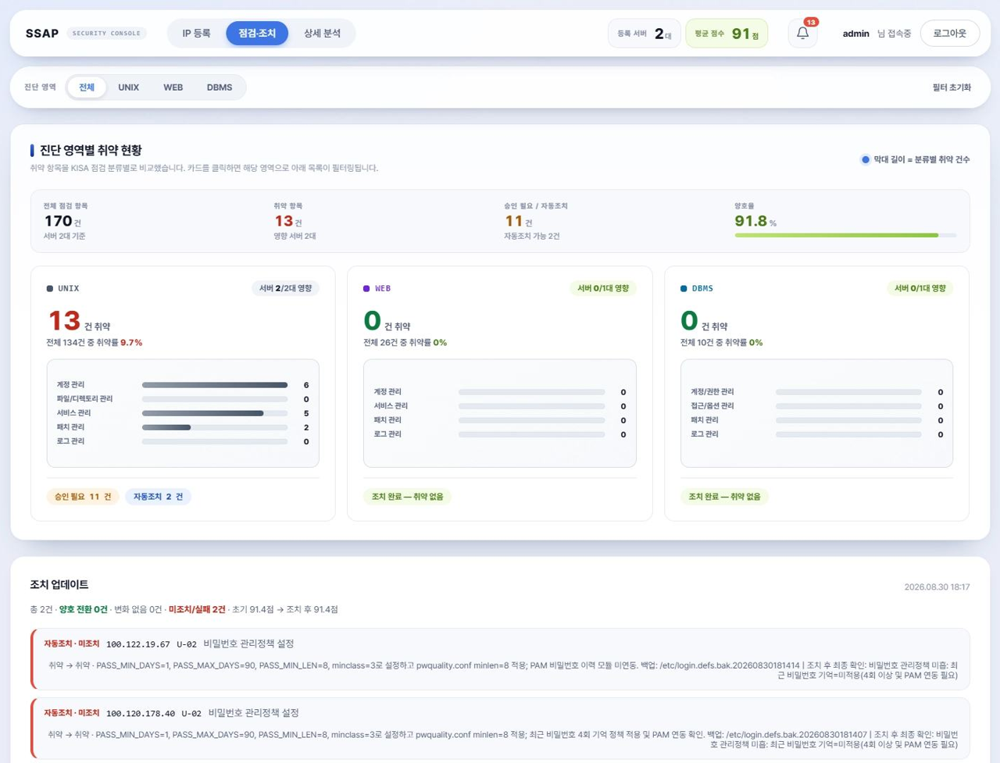
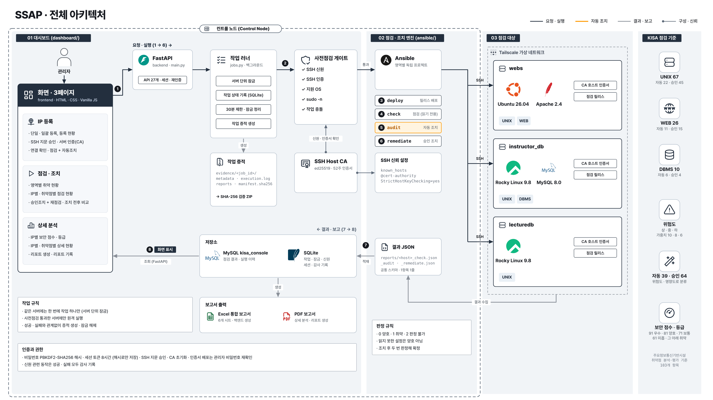
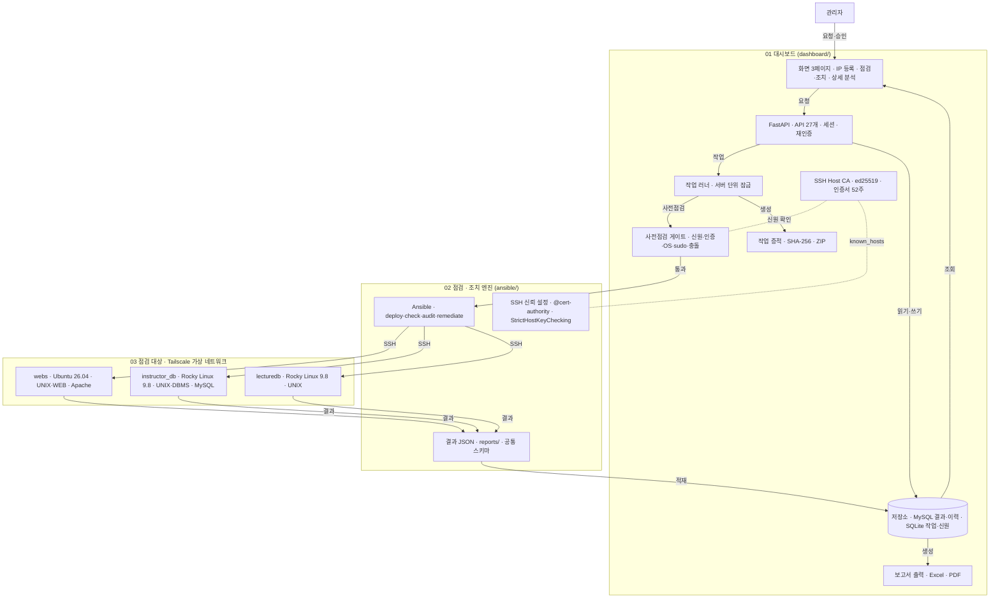
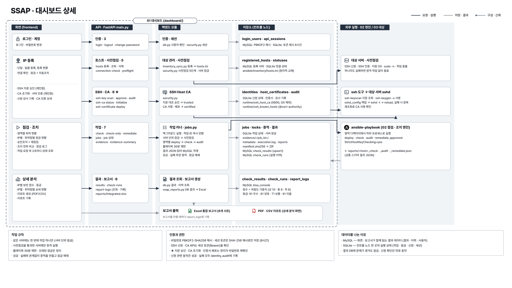
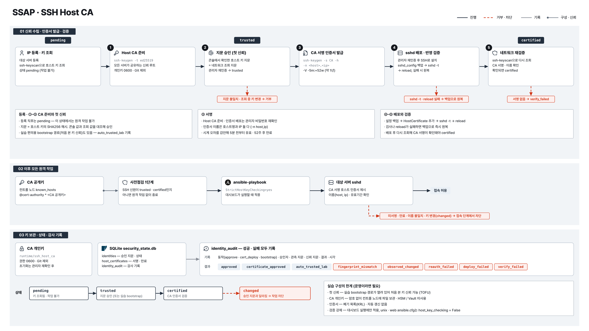
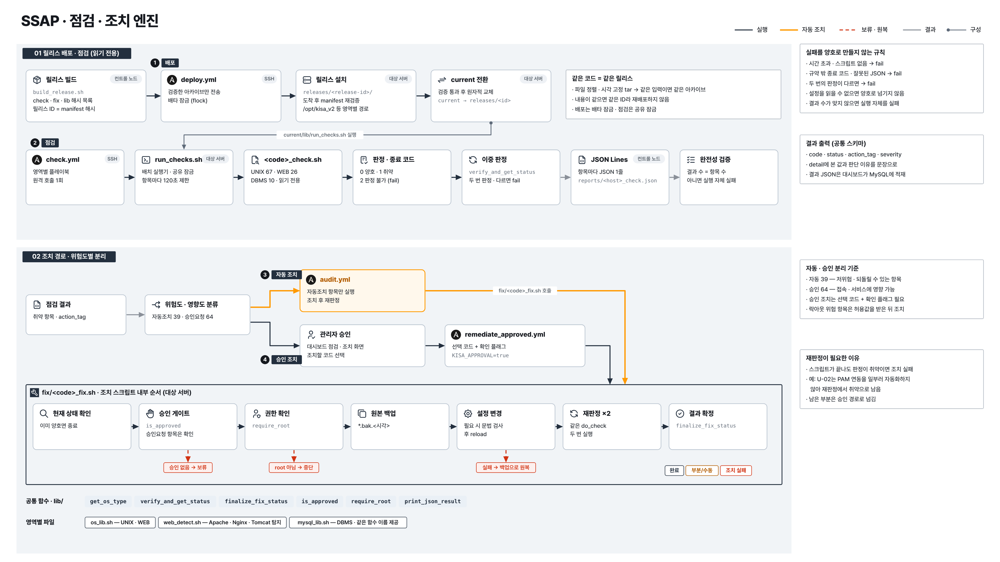
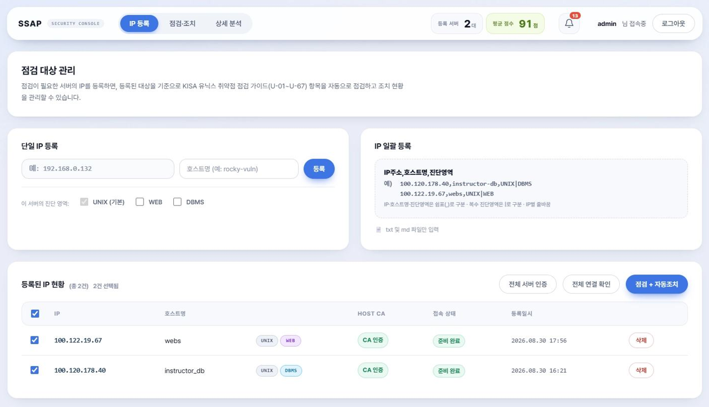
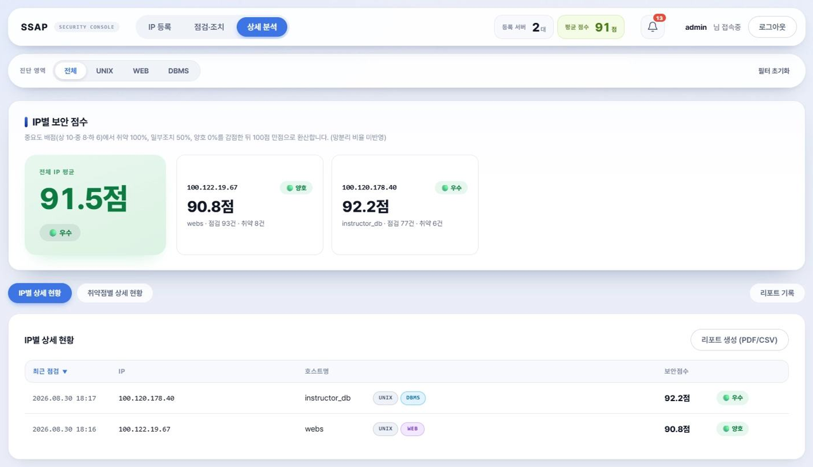

# SSAP — KISA 가이드 기반 취약점 진단·조치 자동화 플랫폼

> **S**ystem **S**ecurity **A**utomation **P**latform
> KISA 「주요정보통신기반시설 기술적 취약점 분석·평가 가이드」를 기준으로
> 여러 대의 서버를 **Ansible로 일괄 점검·조치**하고, 결과를 **웹 대시보드와 통합 보고서**로 관리하는 프로젝트입니다.



- **기간** : 2026.08.18 ~ 2026.08.31 (2주, 4인 팀 프로젝트)
- **담당** : SSH Host CA 인증 구현, 대시보드 개발 (FastAPI 백엔드 · 웹 프론트엔드), 점검 스크립트 검증 (팀 공동)
- **정리 자료** : [포트폴리오](docs/portfolio/portfolio.md) · [회고 글](docs/portfolio/blog.md) · [발표 슬라이드 (PDF)](docs/portfolio/SSAP_slides.pdf)

---

## 목차

1. [프로젝트 배경](#1-프로젝트-배경)
2. [주요 기능](#2-주요-기능)
3. [점검 범위](#3-점검-범위)
4. [기술 스택](#4-기술-스택)
5. [아키텍처와 실행 흐름](#5-아키텍처와-실행-흐름)
6. [저장소 구조](#6-저장소-구조)
7. [설치 및 실행](#7-설치-및-실행)
8. [핵심 설계](#8-핵심-설계)
9. [대시보드 화면](#9-대시보드-화면)
10. [트러블슈팅](#10-트러블슈팅)
11. [한계와 개선 방향](#11-한계와-개선-방향)

---

## 1. 프로젝트 배경

| AS-IS (수동 점검) | TO-BE (자동화 점검) |
|---|---|
| 서버마다 직접 접속해 반복 점검 → 시간 소요 | 서버 일괄 등록 후 Ansible로 다중 서버 병렬 점검 |
| 점검 결과를 사람이 수집 | 표준 JSON으로 결과를 수집해 DB에 자동 적재 |
| 점검자마다 판단 기준이 다름 | KISA 기준을 스크립트로 구현해 동일 기준으로 판정 |
| 조치 결과·이력 관리가 어려움 | 위험도에 따른 자동조치 / 관리자 승인조치 분리, 작업 증적 보존 |
| 보고서를 수작업으로 작성 | 대시보드 시각화 + Excel/PDF 보고서 자동 생성 |

## 2. 주요 기능

- **점검 대상 관리** : 단일 IP 등록 및 `IP,호스트명,진단영역` 형식의 일괄 등록. 등록·삭제 시 Ansible 인벤토리가 자동 동기화됩니다.
- **영역별 선택 점검** : UNIX / WEB / DBMS 영역을 서버·IP 단위로 골라서 점검합니다.
- **자동조치와 승인조치 분리** : 저위험·가역적 항목은 점검 직후 자동조치하고, 접속·서비스에 영향을 줄 수 있는 항목은 관리자가 승인한 코드만 조치 후 재점검합니다.
- **SSH Host CA 기반 접속 대상 검증** : 서버 호스트 키 검증을 생략하지 않고, CA가 서명한 호스트 인증서로 접속 대상의 신원을 확인한 뒤에만 점검·조치를 실행합니다.
- **사전점검(Preflight) 게이트** : SSH 신원 → SSH 인증 → 지원 OS → 비대화형 sudo → 작업 충돌 여부를 확인하고, 하나라도 실패하면 원격 작업을 차단합니다.
- **보안 점수·등급** : 중요도 배점(상 10 · 중 8 · 하 6)에서 취약 100%, 일부조치 50%를 감점해 100점 만점으로 환산합니다.
- **작업 증적** : 작업 로그와 결과를 SHA-256 해시와 함께 보존하고 ZIP으로 내려받을 수 있습니다.
- **통합 보고서** : 요청 시점의 DB 결과로 Excel 보고서를 새로 생성하고, 상세 분석 화면에서 선택한 범위를 PDF로 출력합니다.

## 3. 점검 범위

| 영역 | 항목 | 자동조치 / 승인요청 | 대상 |
|---|---|---|---|
| **UNIX** | U-01 ~ U-67 (67개) | 22 / 45 | Rocky Linux 9·10, Ubuntu 24·26 |
| **WEB** | WEB-01 ~ WEB-26 (26개) | 11 / 15 | Apache(httpd), Nginx, Tomcat |
| **DBMS** | D-01·02·03·04·06·07·08·10·11·25 (10개) | 6 / 4 | MySQL 8.x |

- UNIX : 계정 관리, 파일·디렉터리 관리, 서비스 관리, 패치 관리, 로그 관리
- WEB : 계정 관리, 서비스 관리, 보안 설정, 패치 및 로그 관리
- DBMS : 계정 관리, 접근 관리, 옵션 관리, 패치 관리

## 4. 기술 스택

| 구분 | 사용 기술 |
|---|---|
| 인프라 제어 | Ansible Playbook, Bash Shell Script |
| 접속·인증 | SSH, SSH Host CA (ed25519), Tailscale |
| 점검 대상 OS | Rocky Linux 9·10, Ubuntu 24·26 |
| 백엔드 | Python, FastAPI, SQLAlchemy, MySQL(콘솔 DB), SQLite(작업 상태·잠금) |
| 프론트엔드 | HTML, CSS, Vanilla JavaScript |
| 데이터·보고서 | JSON, CSV, Excel(openpyxl), PDF(브라우저 인쇄) |

## 5. 아키텍처와 실행 흐름

시스템은 **세 영역**으로 나뉩니다. 01 대시보드와 02 점검·조치 엔진은 컨트롤 노드에서, 03은 점검 대상 서버에서 동작합니다.





**읽는 법** — 01 대시보드와 02 점검·조치 엔진은 같은 컨트롤 노드에 있습니다. 관리자가 화면에서 대상과 영역을 골라 작업을 요청·승인하면, FastAPI와 작업 러너가 접속 대상의 신원(SSH Host CA)과 실행 조건(사전점검)을 확인한 뒤 02의 Ansible을 실행합니다. 03의 각 서버는 CA 호스트 인증서로 신원이 검증되고, 배포된 점검 릴리스로 점검·조치를 수행합니다. 서버의 결과는 02의 결과 JSON(`reports/`)으로 모이고, 01의 백엔드가 이를 MySQL에 적재해 화면과 보고서(Excel·PDF)의 근거로 씁니다. 실행 기록은 백엔드가 작업마다 SHA-256 증적으로 남깁니다.

| 영역 | 책임 | 주요 구성 |
|---|---|---|
| 01 대시보드 | 대상 등록, 작업 요청·승인, 사전점검, 작업 실행·잠금, 결과 저장·조회, 증적 보존, 보고서 출력 | 화면, FastAPI, 작업 러너, 사전점검 게이트, SSH Host CA, MySQL·SQLite, 작업 증적 |
| 02 점검 · 조치 엔진 | 점검 릴리스 배포, 점검·조치 플레이북 실행, 결과 수집 | Ansible (unix · web · dbms), 결과 JSON |
| 03 점검 대상 | 점검·조치 스크립트 실행, 결과 생성 | webs, instructor_db, lecturedb |

**실행 흐름** (그림의 ①~⑧)

1. **요청** : 대시보드에서 점검 대상과 진단 영역을 골라 작업을 요청합니다.
2. **사전점검** : 대상 서버의 SSH 신원·인증·OS·sudo·작업 충돌을 확인하고, 하나라도 실패하면 중단합니다.
3. **배포** (`deploy.yml`) : 점검·조치 스크립트를 SHA-256 manifest 릴리스로 배포합니다. 같은 릴리스가 이미 있으면 재배포하지 않습니다.
4. **점검** (`check.yml`) : 읽기 전용으로 실행해 결과 JSON을 수집합니다.
5. **자동조치** (`audit.yml`) : 자동조치 항목만 수정한 뒤 다시 판정합니다.
6. **승인조치** (`remediate_approved.yml`) : 관리자가 승인한 코드만 조치하고 재점검합니다.
7. **적재** : 결과 JSON을 MySQL에 저장하고, 작업마다 SHA-256 증적을 남깁니다.
8. **표시·보고** : 대시보드 화면 3페이지(IP 등록 · 점검·조치 · 상세 분석)에 표시하고, Excel·PDF 보고서를 만듭니다.

### 5.1 세부 아키텍처

**대시보드** — 기능(행)마다 화면 → API → 백엔드 모듈 → 저장소 → 외부 실행 순서로 따라갈 수 있게 정리했습니다.



**SSH Host CA** — 콘솔에서 확인한 호스트 키 지문을 네트워크 조회 지문과 대조해 승인하고(pending → trusted), CA 서명 인증서를 배포·재조회해 certified가 된 서버에만 원격 작업을 허용합니다.



**점검·조치 엔진** — 검증된 릴리스로 읽기 전용 점검을 하고, 조치는 위험도에 따라 자동조치와 승인조치로 나눈 뒤 같은 조치 스크립트 순서(승인 게이트 → 권한 확인 → 백업 → 변경 → 재판정)를 거칩니다.



## 6. 저장소 구조

```text
.
├── dashboard/                 # 관리 콘솔
│   ├── backend/               #   FastAPI API, 작업 러너, 보안(SSH CA·사전점검·증적)
│   │   ├── main.py            #     REST API 엔드포인트
│   │   ├── jobs.py            #     점검·자동조치·승인조치 작업 실행
│   │   ├── security.py        #     SSH 신원/CA, 사전점검, 잠금, 증적
│   │   ├── runtime.py         #     영역별 Ansible 경로·플레이북 설정 (한 곳에서 관리)
│   │   ├── inventory_sync.py  #     콘솔 DB → Ansible 인벤토리 동기화
│   │   ├── ingest_reports.py  #     reports/ JSON 수동 재적재 도구
│   │   ├── ssap_reports.py    #     통합 Excel 보고서 생성기
│   │   ├── db.py · config.py  #     콘솔 DB 모델 · 환경설정
│   │   ├── requirements.txt
│   │   └── .env.example
│   └── frontend/              #   정적 대시보드 (HTML/CSS/Vanilla JS)
│
├── ansible/                   # 점검 엔진
│   ├── unix/                  #   UNIX 진단 (U-01 ~ U-67)
│   ├── web/                   #   WEB 진단 (WEB-01 ~ WEB-26)
│   ├── dbms/                  #   DBMS(MySQL) 진단 (D-항목)
│   │   ├── check/             #     항목별 점검 스크립트 (읽기 전용)
│   │   ├── fix/               #     항목별 조치 스크립트
│   │   ├── lib/               #     공통 Shell 함수, 일괄 실행기(run_checks.sh)
│   │   ├── playbooks/         #     deploy / check / audit / remediate_approved
│   │   ├── inventory/         #     영역별 대상 호스트·변수 (대시보드가 자동 생성)
│   │   ├── reports/           #     점검 결과 JSON (실행 시 생성, Git 제외)
│   │   └── tools/             #     릴리스 빌드(manifest + SHA-256)
│   └── inventory/hosts.ini    #   전체 자산을 역할별로 묶은 통합 인벤토리 (자동 생성)
│
└── docs/                      # 문서용 이미지(images/) · 포트폴리오 자료(portfolio/)
```

루트는 **관리 콘솔(`dashboard/`)** 과 **점검 엔진(`ansible/`)** 두 부분으로 나뉩니다.
엔진 안의 세 진단 영역(`unix/`, `web/`, `dbms/`)은 **같은 폴더 규칙을 공유하는 독립 Ansible 프로젝트**입니다.
따라서 영역별로 따로 배포·검증할 수 있고, 새 진단 영역도 같은 구조로 추가할 수 있습니다.
(DBMS는 추가로 `tasks/`, `templates/`를 사용합니다.)

## 7. 설치 및 실행

### 7.1 요구 사항

- **컨트롤 노드** : Linux, Python **3.10 ~ 3.12**, Ansible, OpenSSH(`ssh-keygen`), MySQL 8.x
  > `requirements.txt`가 SQLAlchemy 1.4를 사용하므로 Python 3.13에서는 설치가 되지 않습니다.
- **점검 대상** : Rocky/RHEL/Ubuntu/Debian 계열, SSH 공개키 접속, 비대화형 sudo(`sudo -n`) 가능

### 7.2 백엔드 준비

```bash
git clone https://github.com/g3onho/system-security-automation-project.git
cd system-security-automation-project/dashboard

python3 -m venv .venv
. .venv/bin/activate
pip install -r backend/requirements.txt
```

콘솔 DB를 만들고 접속 정보를 `dashboard/backend/.env`에 적습니다. 테이블은 첫 실행 때 자동 생성됩니다.

```sql
CREATE DATABASE kisa_console CHARACTER SET utf8mb4;
CREATE USER 'kisa'@'localhost' IDENTIFIED BY 'change-me';
GRANT ALL PRIVILEGES ON kisa_console.* TO 'kisa'@'localhost';
```

```bash
cp backend/.env.example backend/.env
```

```dotenv
KISA_MYSQL_HOST=127.0.0.1
KISA_MYSQL_PORT=3306
KISA_MYSQL_USER=kisa
KISA_MYSQL_PASSWORD=change-me
KISA_MYSQL_DB=kisa_console
```

DBMS 영역의 `ansible/dbms/inventory/group_vars/all.yml`은 MySQL 관리자 비밀번호를 Ansible Vault로 암호화해 두었습니다.
실행하려면 `ansible/dbms/.vault_pass`를 따로 준비하고, 다른 환경에서는 `all.yml.example`을 참고해 새로 만듭니다.
`dashboard/backend/.env`와 `ansible/dbms/.vault_pass`는 커밋하지 않습니다.

### 7.3 콘솔 실행

모든 명령은 `dashboard/` 디렉터리에서 실행합니다.

```bash
# 백엔드 API (8000번 포트)
uvicorn backend.main:app --reload --port 8000

# 프론트엔드 (별도 터미널, 8080번 포트)
python3 -m http.server 8080 --directory frontend
```

브라우저에서 `http://<컨트롤노드>:8080/dashboard.html`에 접속합니다.
프론트엔드는 같은 호스트의 8000번 포트를 API로 사용합니다.

> 최초 실행 시 관리자 계정이 없으면 `admin / P@ssw0rd`가 생성됩니다. **로그인 직후 비밀번호를 변경하세요.**

### 7.4 SSH Host CA 설정 (실습용)

1. IP 등록 화면에서 관리자 재인증 후 **실습 Host CA 초기화**를 실행합니다.
   CA 개인키는 `runtime/ssh_host_ca`(권한 `0600`, Git 제외)에, 공개키는 `runtime/ssh_host_ca.pub`에 저장됩니다.
2. 서버 콘솔에서 확인한 호스트 키 지문을 입력해 SSH 신원을 승인합니다(관리자 재인증). 실습에서는 승인 없이 **전체 서버 인증**을 실행하면 처음 관측한 키를 신뢰하는 bootstrap 경로(감사 로그 `auto_trusted_lab`)도 쓸 수 있습니다.
3. **인증서 배포**를 실행하면 대상의 `/etc/ssh/sshd_config`를 타임스탬프로 백업하고,
   `sshd -t` 문법 검사와 reload가 모두 성공한 경우에만 인증서를 다시 검증합니다. 실패하면 즉시 원복합니다.
4. 이후 CA 인증 호스트는 서버별 키 등록 없이 **CA 서명 + 호스트명/IP principal**로 검증됩니다. 인증서 유효기간은 52주입니다.

> **이 구성은 실습 전용입니다.** 구현 범위와 한계는 다음과 같습니다.
>
> - 첫 신뢰: 처음 접속한 서버가 진짜인지 지문 대조로 확인하도록 만들었지만, 실습 편의를 위해 이 확인을 건너뛰고 처음 받은 키를 그대로 믿는 경로(bootstrap)도 남겨 두었습니다. 이 경로는 기록에 `auto_trusted_lab`으로 표시되지만, 첫 접속 순간 가짜 서버가 응답하면 걸러내지 못합니다(TOFU의 한계).
> - CA 개인키: 암호 없이 컨트롤 노드에 파일로 보관합니다(`0600`, Git 제외). HSM·Vault는 쓰지 않습니다.
> - 인증서: 52주 만료만 있고 폐기 목록(KRL)·자동 갱신은 없습니다.
> - 검증 강제: 대시보드가 실행할 때만 `StrictHostKeyChecking=yes`가 적용됩니다. `ansible/unix`·`ansible/web`의 `ansible.cfg`는 `host_key_checking = False`이므로 7.5처럼 수동 실행하면 검증되지 않습니다.

### 7.5 영역별 수동 실행 (대시보드 없이)

각 영역 디렉터리에서 실행합니다.

```bash
cd ansible/unix        # 또는 ansible/web
ansible-playbook playbooks/deploy.yml -e target_hosts=<host>   # 스크립트 배포
ansible-playbook playbooks/check.yml  -e target_hosts=<host>   # 점검 (설정 변경 없음)
ansible-playbook playbooks/audit.yml  -e target_hosts=<host>   # 자동조치
ansible-playbook playbooks/remediate_approved.yml \
  -e target_hosts=<host> \
  -e kisa_selected_codes=U-01,U-05 \
  -e kisa_confirm=true                                          # 승인조치
```

```bash
cd ansible/dbms
ansible-playbook playbooks/deploy.yml -e target_hosts=<host>
ansible-playbook playbooks/check.yml  -e target_hosts=<host>
ansible-playbook playbooks/audit.yml  -e target_hosts=<host>
ansible-playbook playbooks/remediate_approved.yml \
  -e target_hosts=<host> \
  -e mysql_security_selected_codes=D-08,D-10 \
  -e mysql_security_confirm=true
```

일부 UNIX 항목은 락아웃 위험 때문에 관리자가 값을 지정해야 조치가 진행됩니다.
필요한 환경변수는 [`ansible/unix/docs/override_env_vars.md`](ansible/unix/docs/override_env_vars.md)를 참고하세요.

### 7.6 기타 도구

```bash
# reports/ 의 점검 JSON을 콘솔 DB에 다시 적재
python3 -m backend.ingest_reports
python3 -m backend.ingest_reports --domain WEB --host webs

# 샘플 데이터로 Excel 보고서 미리보기 생성 (ssap_reports_preview.xlsx)
python3 -m backend.ssap_reports
```

## 8. 핵심 설계

### 8.1 결과 필드 표준화

진단 영역이 달라도 결과 JSON의 필드 구조는 같습니다. 그래서 DB·백엔드·프론트엔드·채점 로직을 모든 영역에 공통으로 적용할 수 있습니다.

```json
{
  "code": "WEB-04",
  "title": "디렉터리 리스팅 비활성화",
  "status": "양호",
  "action": "점검",
  "action_tag": "자동조치",
  "severity": "상",
  "impact": "재접속 정보 갱신 필요",
  "detail": "판정 근거 상세",
  "os_type": "ubuntu 26.04",
  "timestamp": "2026-08-26T10:20:07+09:00",
  "release_hash": "e28e739c…",
  "duration_seconds": 1
}
```

| 필드 | 설명 | 생성 주체 |
|---|---|---|
| `code` | 항목 코드 (접두사로 진단 영역 자동 분류) | 점검 스크립트 |
| `status` | 양호 · 취약 · fail | 점검 스크립트 |
| `action_tag` | 자동조치 · 승인요청 (조치 권한 게이트) | 점검 스크립트 |
| `severity` | 상 · 중 · 하 (채점 가중치 10 · 8 · 6) | 점검 스크립트 |
| `os_type`, `timestamp` | OS·서비스 버전, 실행 시각(ISO 8601) | 공통 라이브러리 |
| `release_hash`, `duration_seconds` | 배포 릴리스 버전(SHA-256), 소요 시간 | `run_checks.sh` |

### 8.2 자동조치와 승인조치의 분리

| 비교 기준 | 자동조치 | 승인조치 |
|---|---|---|
| 서비스 영향 | 영향 없이 적용 | 접속·세션 영향 가능 |
| 변경 위험 | 저위험·가역적 | 고위험·비가역적 |
| 운영 상태 | 정상 운영 중 실행 | 장애 가능성 사전 검토 |
| 판단·복구 | 즉시 롤백 가능 | 관리자 승인 후 실행 |

### 8.3 안전 원칙

- 점검 플레이북은 설정을 변경하지 않습니다.
- 자동조치는 점검 후 별도 플레이북으로 실행합니다.
- 승인조치는 **선택 코드와 확인 플래그가 모두 있어야** 실행됩니다.
- DBMS 승인조치에서는 자동조치 항목을 다시 실행하지 않습니다.
- 배포 릴리스는 manifest(SHA-256) 검증을 통과한 뒤에만 `current`로 전환합니다.
- 한 서버에는 동시에 하나의 작업만 실행되도록 잠금을 사용합니다.

### 8.4 SSH Host CA를 도입한 이유

기존 Ansible 설정은 서버 호스트 키 검증을 생략(`host_key_checking = False`)해 빠르게 실행할 수 있었지만,
**잘못된 서버에도 점검·조치가 실행될 수 있는** 문제가 있었습니다.
서버마다 호스트 키를 관리하는 대신 CA 서명을 신뢰하도록 바꿔, 서명되지 않았거나 만료·불일치한 서버는 자동으로 차단하고
(대시보드에서 실행하는 플레이북은 `StrictHostKeyChecking=yes`와 콘솔이 관리하는 known_hosts로 강제됩니다)
서버 수가 늘어나도 CA 공개키 한 줄로 같은 신뢰 기준을 적용할 수 있게 했습니다.

실습 서버는 3대였지만 이 프로젝트는 **여러 대의 서버를 한 번에 점검하는 자동화**를 지향합니다. 모든 작업이 SSH로 이뤄지는데, 서버마다 호스트 키를 확인·등록하는 방식은 서버가 늘수록 SSH 연결 관리가 복잡해집니다.
CA를 쓰면 컨트롤 노드는 CA 공개키 한 줄만 신뢰하면 되므로, 실습 기간 안에 운영 수준의 CA(첫 신뢰 검증, CA 키 보호, 인증서 폐기·갱신)까지 만들 수는 없다는 걸 알면서도
먼저 3대 규모에서 이 구조가 동작하는지 확인해 두었습니다. 구현하지 못한 부분은 7.4의 한계 목록에 정리했습니다.

## 9. 대시보드 화면

| IP 등록 | 상세 분석 |
|---|---|
|  |  |

| 메뉴 | 내용 |
|---|---|
| **IP 등록** | 단일·일괄 등록, 호스트별 진단 영역 지정, Host CA 인증·연결 확인 |
| **점검·조치** | 진단 영역별 취약 현황, IP별/취약점별 목록, 승인조치 후 재점검 |
| **상세 분석** | IP별·취약점별 상세 현황, 영역별 보안 점수와 등급, 실행 이력 |
| **리포트 기록** (상세 분석 내) | 출력 범위를 지정한 PDF 보고서, 통합 Excel 보고서, 생성자·일시 기록 |

**통합 Excel 보고서** (`ssap_reports_YYYYMMDD_HHMM.xlsx`)는 다운로드 버튼을 누를 때마다 현재 DB 결과로 새로 만들어지며,
표지(Dashboard) · 자산현황 · 조치 항목 · 서버 상세 · 참고 가이드 · 작업 증적 시트로 구성됩니다.

## 10. 트러블슈팅

**두 세대의 결과 스키마가 섞여 대시보드가 깨진 문제**

초기에는 영역마다 결과 형식이 달랐습니다. 예를 들어 DBMS 결과는 `rule`, 영문 `status`(`PASS`) 등 4개 필드만 있었고,
조치 권한을 구분할 필드도 없었습니다. 그 결과 컨트롤 노드에 구버전과 신버전 리포트가 함께 남아 집계가 어긋났습니다.

→ 모든 영역의 결과를 공통 스키마(10개 이상 필드, 한글 `status`, `code` 필드명 통일)로 맞추고,
`action_tag`를 추가해 **승인 게이트에 편입**했습니다. 이후 DB 스키마 변경 없이 영역을 자동 분류하고 같은 채점 기준을 적용할 수 있게 됐습니다.

## 11. 한계와 개선 방향

- 초기 아키텍처 설계가 늦어져 서버 연동 범위가 줄었습니다.
- Windows 점검 환경은 지원하지 않습니다.
- DBMS는 MySQL 기준 10개 항목만 구현되어 있습니다.
- 서버 장애·네트워크 단절 같은 예외 상황 처리와 Edge Case 테스트를 더 보완해야 합니다.
- SSH Host CA는 실습용 구성입니다(7.4 참고). bootstrap 경로 차단, CA 개인키 보호(HSM·Vault), 인증서 폐기·갱신, 수동 실행 시 호스트 키 검증이 필요합니다.
